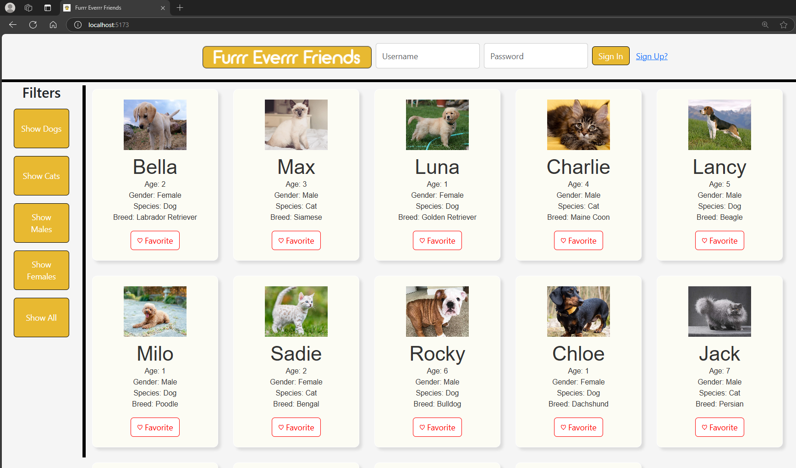

# Dockerized Full-Stack Pet Adoption Web Application


---

## **Steps to Run Dockerized WebApp**

**Note**: Ensure you are in the `../cse2102-fall24-Team51/` directory while running these commands.

### **Backend Setup**:

1. **Build the Backend Docker Image**:
   ```bash
   docker build -f Backend/docker_files/Dockerfile -t team51-backend .

2. **Run Backend with terminal command (Backend runs on port 5170)**:
   ```bash
   docker run -d -p 5170:5000 team51-backend
   
3. **Build the Frontend Docker Image**:
   ```bash
   docker build -f Frontend/docker_files/Dockerfile -t team51-frontend .
   
4. **Run Frontend with terminal command (Frontend runs on port 5173)**:
   ```bash
   docker run -d -p 5173:5173 team51-frontend
   
5.  **The WebApp should now be visable at "http://localhost:5173/"**:

---
## **Technologies and Tools Used**
- **Python**
- **JavaScript**
- **TypeScript**
- **Flask**
- **SQL**
- **Node.js**
- **React.js**
- **REST API**
- **AWS**
- **Git**
- **Docker**
- **YAML**
- **Unit Testing Frameworks**

---

## **Links**
- **Project Video Link**: [Youtube Link](https://youtu.be/wL0esWZsHKM)  
- **Kanban Board**: [Kanban Board](https://trello.com/b/j8t0Ulvk/group-51-jira-kaban-board)  
- **Prototype Design**: [Prototype Design](https://www.figma.com/design/mKMWW1sIOVpuQKOlapBINQ/ishayu.ray)

